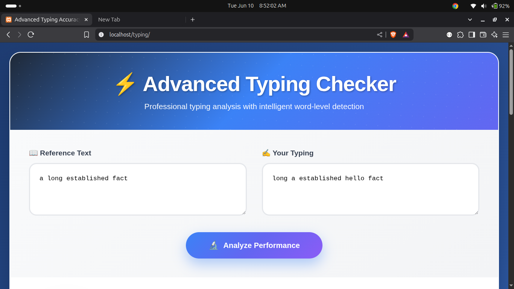
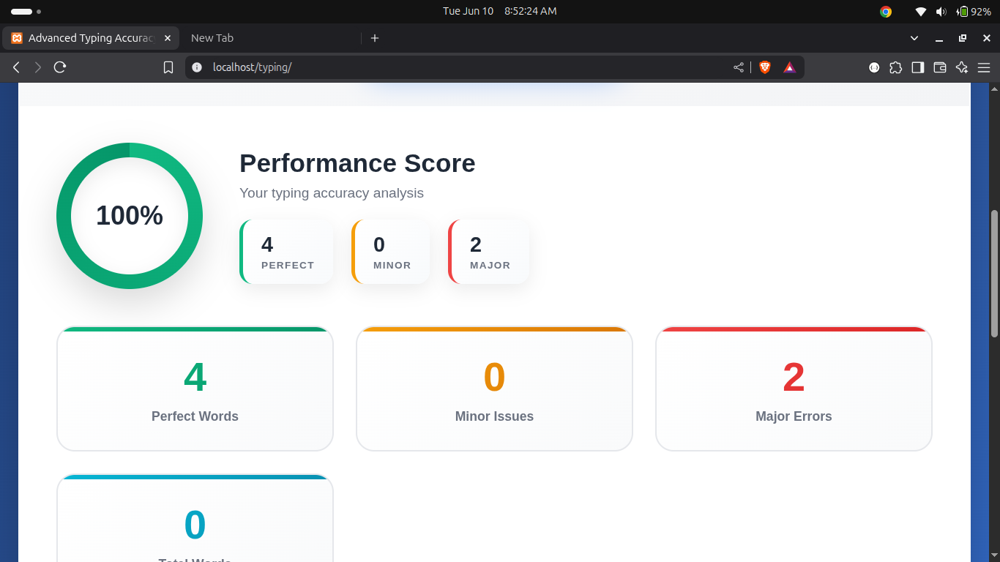
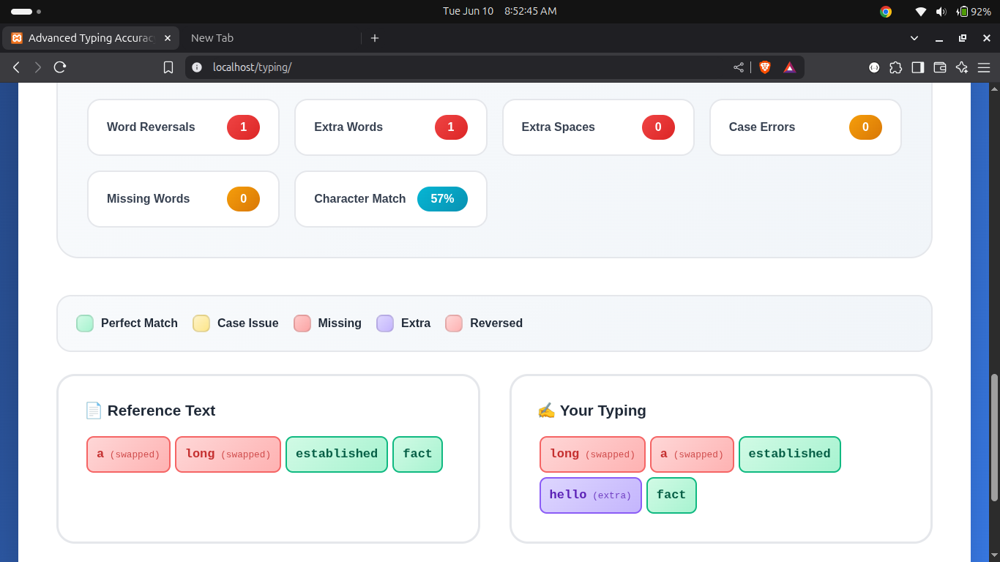

# Typing Test ⌨️





A simple and interactive typing speed test web app to measure your typing speed in Words Per Minute (WPM) and accuracy. Built using **HTML**, **CSS**, and **JavaScript**.

🔗 **Live Demo:** [https://shivamsheokand.github.io/typing-test/](https://shivamsheokand.github.io/typing-test/)

---

## 🚀 Features

- 🧠 Random sentences for each test
- ⏱ Timer starts on first keystroke
- 📊 Displays WPM, accuracy, and error count
- 🔄 Restart test with a single click
- 📱 Responsive for all devices

---

## 💻 Technologies Used

- HTML
- CSS
- JavaScript (Vanilla)

---

## 🧪 How It Works

- A random sentence is displayed.
- Timer starts with the first keystroke.
- As you type, the app compares each character.
- Accuracy and WPM are calculated as you complete the test.

**Formula:**

- `WPM = (Total characters / 5) / Minutes`
- `Accuracy = (Correct Characters / Total Typed) * 100`

---

## 📂 Getting Started

To run it locally:

```bash
git clone https://github.com/shivamsheokand/typing-test.git
cd typing-test
open index.html
```

## ☕ Support My Work

<p align="center">
  <a href="https://buymeacoffee.com/shivamsheokand">
    
  </a>
  <a href="https://paypal.me/developersam">
    
  </a>
</p>
